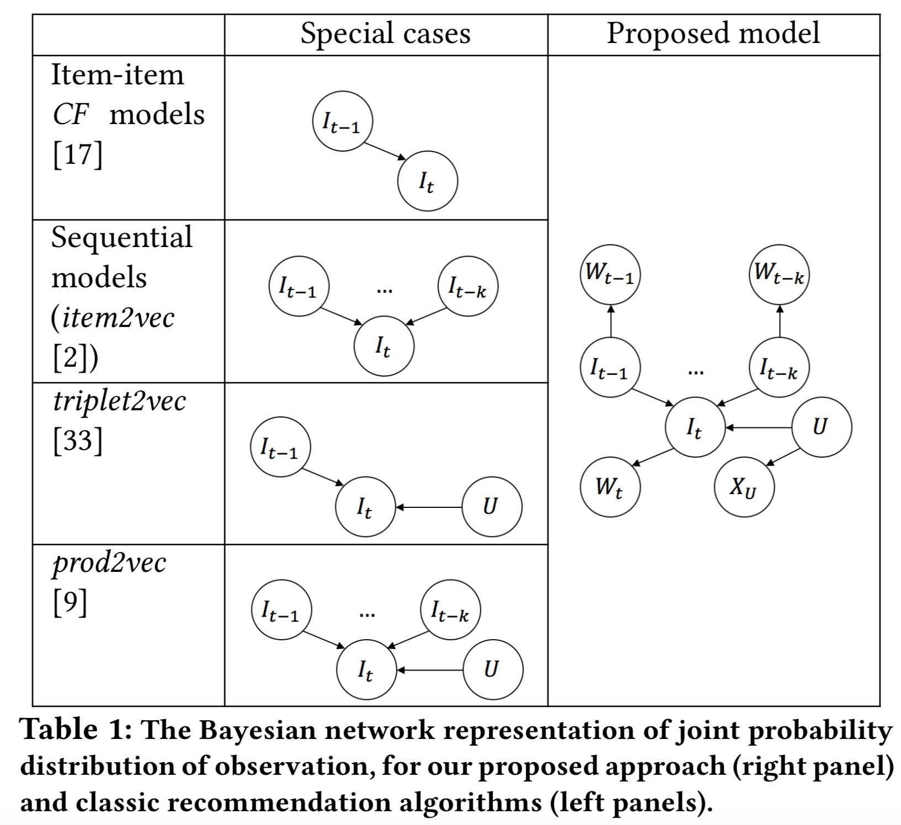

# Knowledge-aware Complementary Product Representation Learning (WSDM 2020)
This repo contains the reference implementation proposed in the paper <strong>Knowledge-aware Complementary Product Representation Learning</strong>.

<p align="center">

</p>

Please contact at Chuanwei.Ruan@walmartlabs.com or Da.Xu@walmartlabs.com for questions.
# Requirements

* cmake 3.0 or newer
* gcc/g++-4.7.2 or newer
* Eigen 


# Installation 
## Compile

```{bash}
cd uni-vec
mkdir build
cd build
cmake ../ # use cmake3 if using centOS with outdated cmake since install cmake3 would be much easier than updating cmake
make
```

## If cmake failed due to not eigen found:
```
cd third_party/eigen
make build
cd build
cmake ..
make 
make install
```

## How to make on CentOS

```
# only install once
sudo yum install centos-release-scl
sudo yum install devtoolset-6

# need to type it every time open a new terminal
scl enable devtoolset-6 bash
```

# Running the code

An simple example:
```
./build/uni-vec train -itemWordInput ${ITEM_WORD_INPUT} -userHistInput ${USER_HIST_INPUT} -output ${OUTPUT_PREFIX} -thread ${NUM_THREAD} -epoch ${NUM_EPOCHS} -dim ${DIM} -userDim ${USER_DIM} -neg ${NEG}
```
runs the model with item-context interaction data and user-item interaction data.

The complete example `run.sh` can be found under the `script` folder.

## Required data format

### Mandatory data

* Item contextual data

Tab seperated file with variable number of columns. First column is item index. the rest columns are the token (word, context, etc) index. All the item index are required to appear in this file (even if there is no token), e.g. 

item_index \t token_index_1 \t ... \t token_index_n

```
0   100   101   200   201
1   523   14   41   12
...
```

* User purchase sequence

Tab seperated file with three columns. First column is the user index; second column is a comma seperated list of double numbers representing the timestamp; third column is a comma seperated list of intergers representing the item index, e.g.

user_index \t timestamp_1,timestamp_2,...,timestamp_k \t item_index_1,...,item_index_k

```
999    100.0,200.0,300.0    1,2,3
333    10.0,20.0    11,21
...
```
<strong>Note that all the item, user, token data must be first converted to index strarting from 0. The output embeddings are arranged according to the index, i.e. the first row in item embedding output file corresponds to item with index 0.

That being said, all data preprocessing must be done beforehand.</strong>

### Optional data

* User contextual data

The format is the same with that of the item-context data, i.e. 

user_index \t user_token_1 \t ...

* User view sequence

The foramt is the same with that of purchase records. When provided, the item_view embedding will be part of the output. View sequence will be trained jointly with purchase sequence. 

### Note on data related issues

* To help understand the data format, we provide a dummy dataset under the `test` folder which also incudes the python code to generate such dummy data. 

* Currently the input data need to be loaded into memory. If the program is killed, it may be caused by a lack of memory.

* When running into segmentation fault issues, please first double check if there are gaps in the user index, item index or the context index. 


## Arguments and options

### Mandatory arguments

* `-itemWordInput`: path for item conext path

* `-userHistInput`: path for the user purchase records

* `-output`: prefix for the output embeddings

### Optional training arguments

* `-thread`: number of threads used for training. Set it equal to or less than the actual number of CPU cores for best performance. 

* `-dim`: dimension of the item and item context embeddings. Default is 100.

* `-userDim`: dimension of the user and user context embeddings. Default is the same with the dimension of item embeddings.

* `-epoch`: number of epochs to train. Default is 5.

* `-ws`: window size used during generating the training examples from purchase example. Default is 5.

* `-neg`: number of negative samples.

* `-lr`: learning rate. Default is 0.05.

* `-lrUpdateRate`: update progress every `lrUpdateRate` many of examples.


# Acknowledgement

Part of the implementation is adapted from Facebook fasttext library (https://github.com/facebookresearch/fastText/).


# Citation 
ACM Reference Format:

Da Xu, Chuanwei Ruan, and Jason Cho, Evren Korpeoglu, Sushant Kumar,
Kannan Achan. 2020. Knowledge-aware Complementary Product Representation Learning. In The Thirteenth ACM International Conference on Web
Search and Data Mining (WSDM ’20), February 3–7, 2020, Houston, TX, USA.
ACM, New York, NY, USA, 10 pages. https://doi.org/10.1145/3336191.3371854
